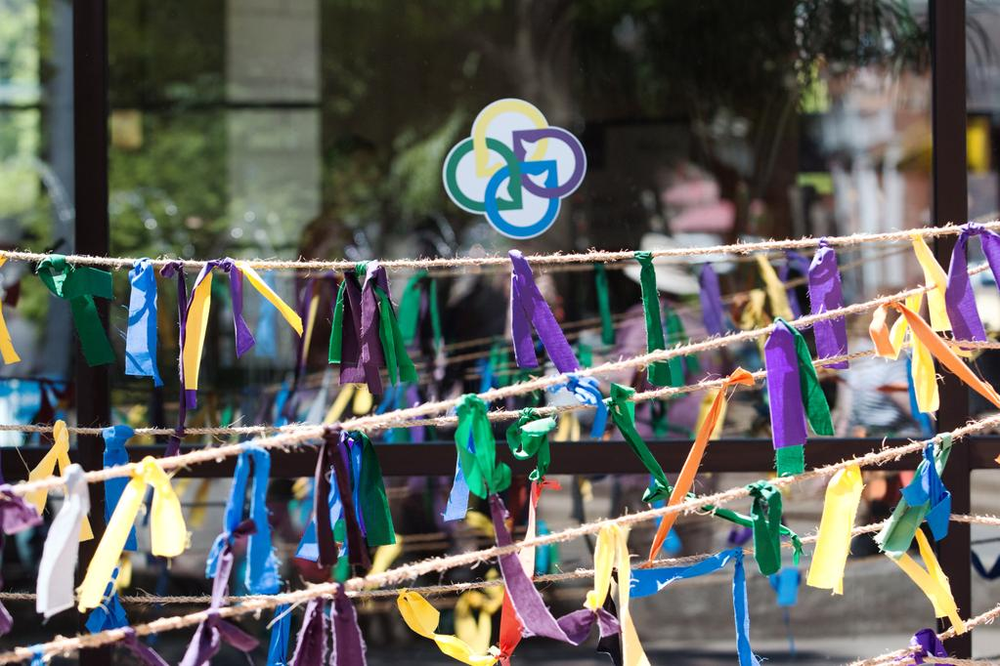

# [fit] Skip the blog post.
# [fit] Launch a side product instead.

### Levi Bostian @levibostian

^ How many of you started a business or work for a business that sells a product.

^ Ok. I'll assume the rest of you do service/consulting based work. Either one I believe will find value in this.

---

#### My name is Levi.

### Minimalist/simple living, environmentalist, geek, writer, side project hacker, productivity hacker.
### I enjoy outdoors, retro video games, street art.

^ Let's start getting to know me a little better this guy who is talking to you today. My name is Levi. I am born and raised in Northeast Iowa and currently live in Cedar Rapids.

^ I really enjoy having conversations about life with people. I want to put this list of my hobbies here so if you have interest in these and want to ask me some random questions, please feel free. I would love that!

---

### I ❤️ building stuff.

### Founder, freelancer, mentor.

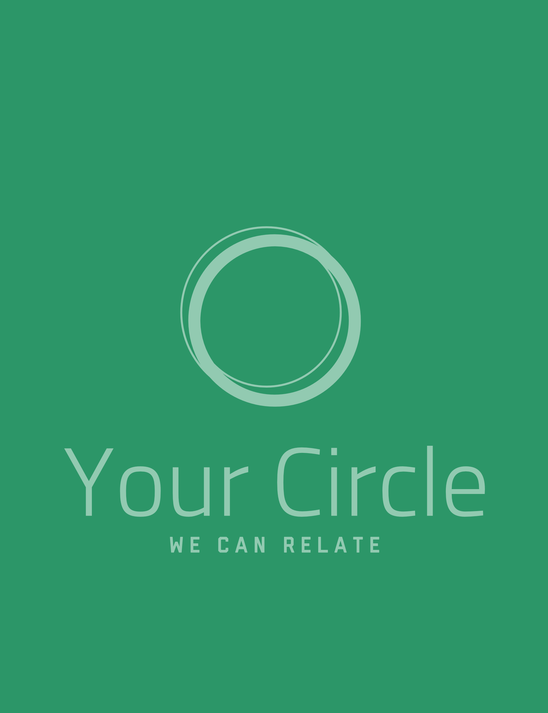

^ I am here talking to you today because I am a founder, freelancer, and mentor.

^ I am the founder of Your Circle, a virtual support group mobile app. I am a freelancer building mobile apps for startups, that's Curiosity IO. I am also the co-founder of Caddy. Tech products for small business owners. We just launched an email product there built just for entrepreneurs like all of you. Check it out, I know you will like it.

^ This is a talk about marketing coming from a guy who you not consider a "marketing expert". This talk is by a guy who builds stuff and works with startups every single day. This is stand-back overview of what I see with many startups and what I do differently.

---

## I am **obsessed** with products.

### Building something that improves the life of someone.

^ For the past year and a half I have dedicated myself to products. Learn how to build products. Learn about the many business models of them. Read and talk to founders who build products. Learn how to sell products. I have become obsessed with everything having to do with building products.

^ You are the lucky ones. You get to hear about all of my knowledge I have built up over the past couple of years. Meeting and talking to founders and their experiences.

---

"How do I build an audience for my new product?", you ask.

"Easy! Create a Facebook, Twitter, Instagram and Snapchat account. Create a blog. Buy Facebook ads."

Done.

^ Congrats! You started a new business! Now, you ask...

---

Typical marketing plan I see:

* Social media accounts.
* Blog posts.
* Ads online.

^ Though my experience with startups, this is the typical content marketing plan they have to build an audience. Create tons of noise to gain the eyeballs of people in the market.

---

### "We can't hire a sales team."

### "It's what everyone else is doing."

### "It's easy."

^ When I ask the founders why they choose this plan, these are the responses that I get...

^ These don't see like convincing reasons to me.

---

### **What is marketing again?**

Find new group of people. Build a relationship. Gain trust. Show them how you can improve their life.

Why measure in eyeballs? Instead, measure by happy/engaged people.

^ I see so many startups doing what is easy, doing what is hot. Doing all they can for pure eyeballs and attention.

^ Take a step back and remind yourself what marketing really is...

---

Compared to core product, blog posts not super engaging.

People come once, maybe read post, and never come back.

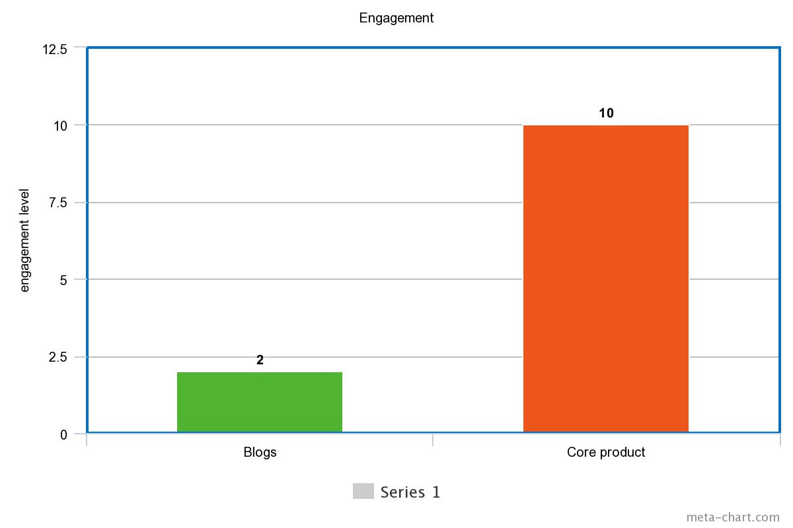

^ (read slide)

---

Compared to core product, blog posts do not gain very much trust.

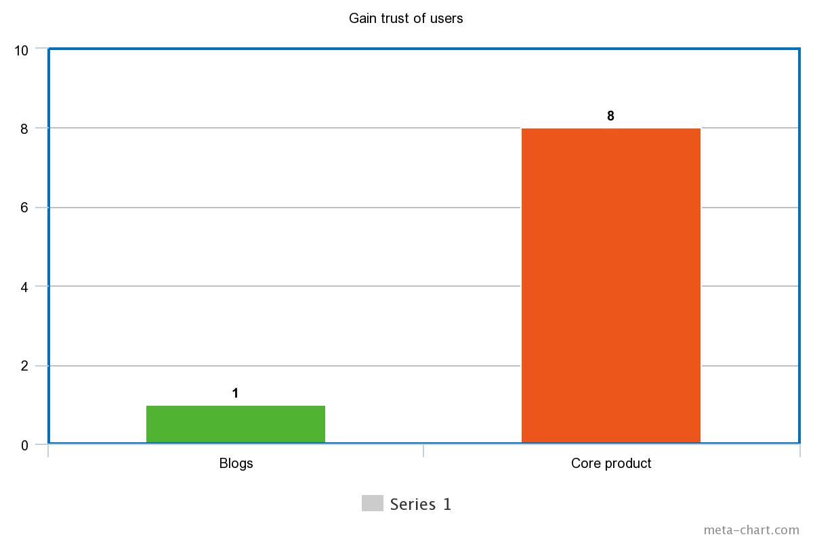

^ (read slide)

---

But for time and cost, blog posts can be cost efficient compared to building a core product.

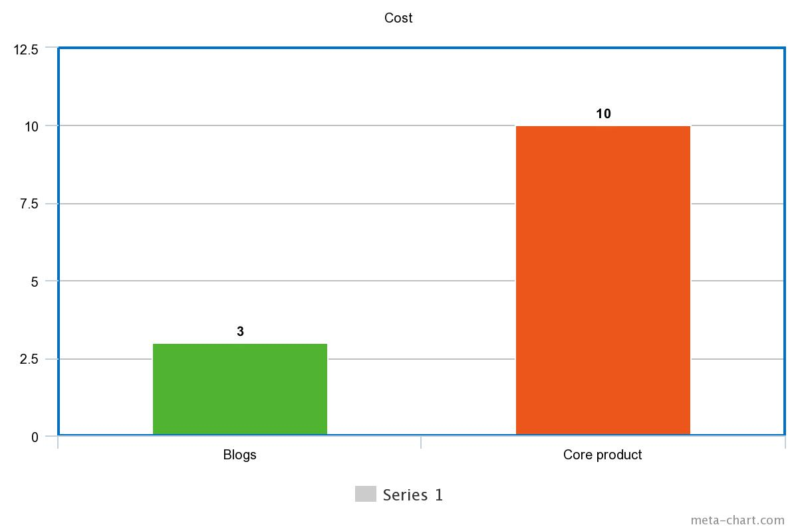

^ (read slide)

---

### **My question:**

## Is there a better way?

High engagement. Builds relationships. Gains trust. Cost effective.

...Not blocked by adblock üòâ

**Does this exist?!?!**

^ (read slide)

---

## Yes.

^ Yes. Of course the answer is yes or why would I be talking to you today?

---

### Side project marketing.

#### Build side projects that drive sales to core product of business.

###### High engagement. Low cost. Builds trust.

^ Ta-da!! Side project marketing...

---

### **Fact:**

### People **hire products** to solve problems in their lives.

^ I did not quote this. I heard it in a tweet or something. (read it)

---

* Apps on your phone.
* Clothes you are wearing.
* The book you're reading.
* The notebook you're writing on.
* Me! This conference.

^ Think about it. (read slide).

^ All of these things you have hired to make your life better. Products are awesome!

---

## **Q:** Who is doing this already?

^ I did not invent this idea of side project marketing. I simply subscribe to it because I believe in it's opportunity.

---

# [fit] Crew.co
### Marketplace for design freelancers.
#### Target marketing is online entrepreneurs

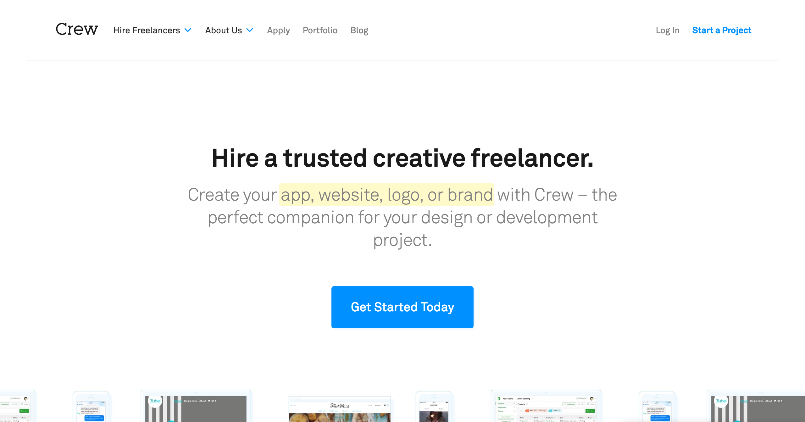

^ One company that believes in it is Crew.co....

---

Blog posts, and webinars were once marketing gold. Now, websites, apps, and tools are taking over.

You must create value with your marketing because it's the only knife that can cut through the today’s noise.

It works. It saved our company.

###### -- Mikael, founder Crew.

^ When you go to the website for Crew.co, you will find this quick gist about their marketing plan. (read it.)

^ (DONT talk about selling to dribble)

---

# [fit] How to build an online business

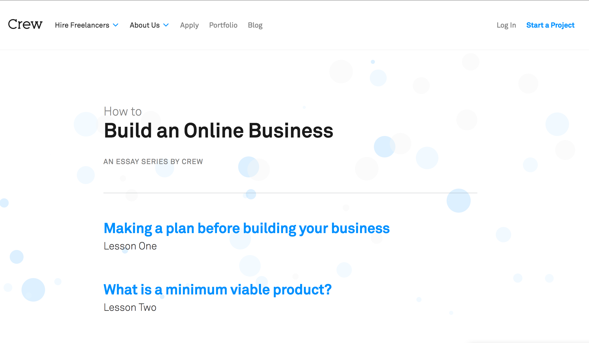

#### Online course for frustrated entrepreneurs.
#### Drives traffic for future customers.

^ Here are some of their side products they have created...

---

# [fit] How much to make  

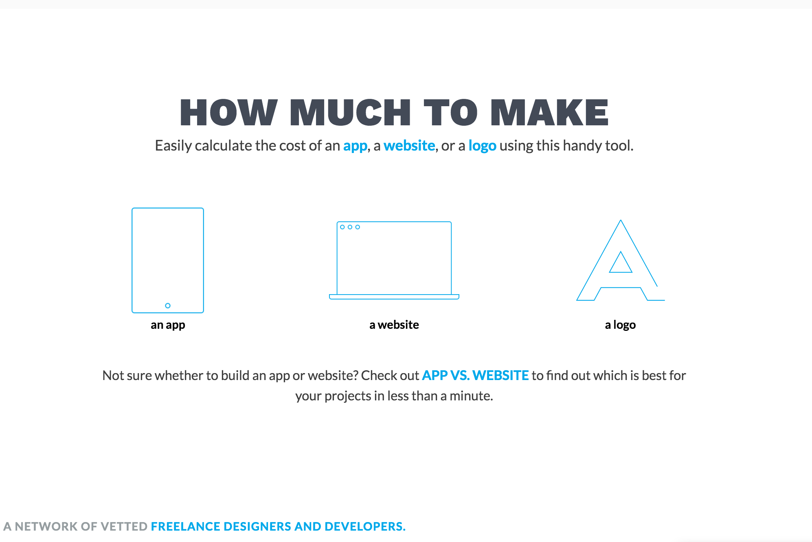

#### Website giving estimates to cost of app, website, logo.
#### Better quality customers. More understanding customers.

^ (read it)

---

# [fit] Unsplash.com

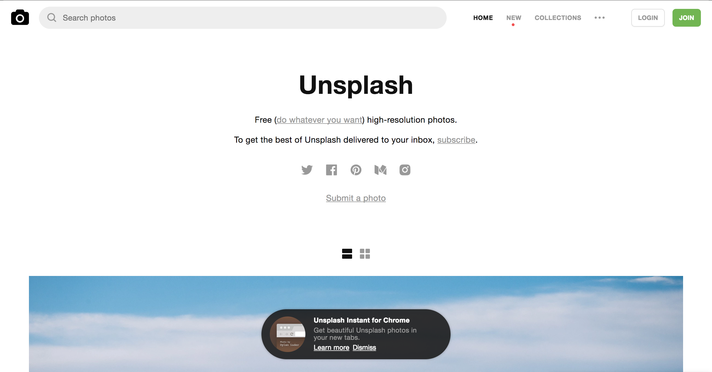

#### Best stock photos, ever.
#### Team needed stock photos for building websites for clients.

^ (read it).

---

Crew's blog.

* 2 years, 266 posts.
* 102,000 unique visitors/month
* 6,000 email subscribers
* #3 referral source to Crew

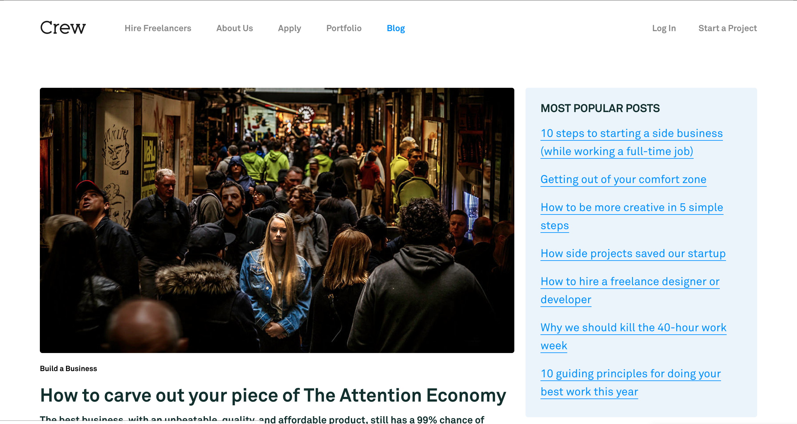

^ Crew has a blog. These numbers were published last year...

---

Side products at Crew:

* Create 1 - 2 products per month.
* **40 times** the number of subscribers.
* Less time and maintenance then blog posts.
* Longer shelf life. (look at high returning visitors for Unsplash --->)
* 50+ resumes per week.

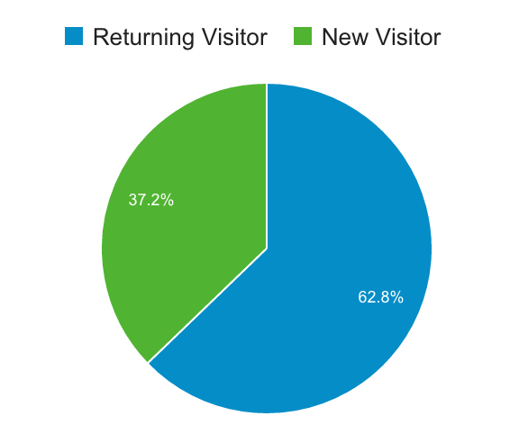

^ These are the results of side projects at Crew.

---

#### “We had 3 months worth of cash to turn things around. A marketing budget? Please. We were just trying to keep the lights on.”
##### -- Mikael Cho, Founder Crew.

^ Mikael wrote this in a blog post about how side products saved his business. 3 years ago they were almost dead and last month they sold Crew to Dribbble.

---

# [fit] Buffer.com
### Social media scheduling tool.

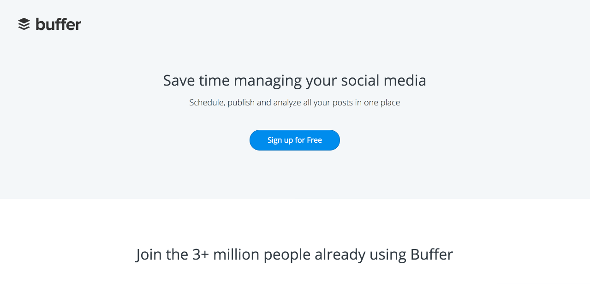

^ Here is another company that actively develops side products to sell. Buffer.

---

## Pablo

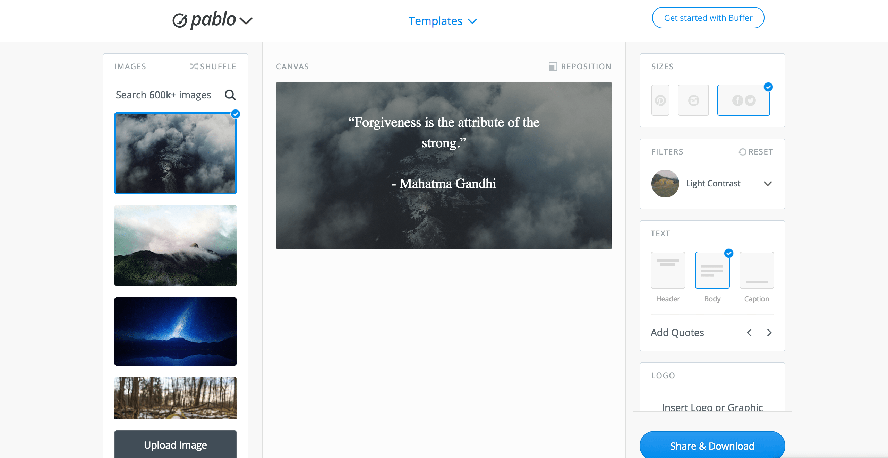

#### Create images with text overlay for social.
#### More content published on Buffer.

^ (read it)

---

## Optimal schedule tool

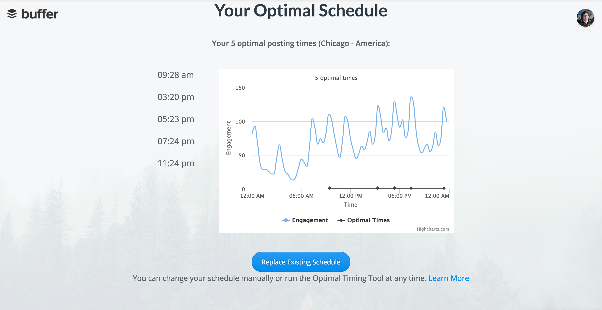

#### Tells best times in day to post to social.
#### Users see more value in Buffer tool.

^ (read it)

---

## Social Media 101

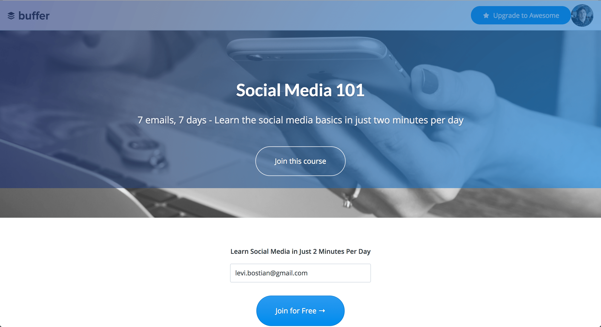

#### Online class to build social strategy.
#### Users see more value in Buffer tool.

^ (read it)

---

### "Each and every product that you release is show and tell for your business." -- me

^ This is why I believe in product based marketing. (read it).

^ Think back to kindergarten class. You have this thing...

---

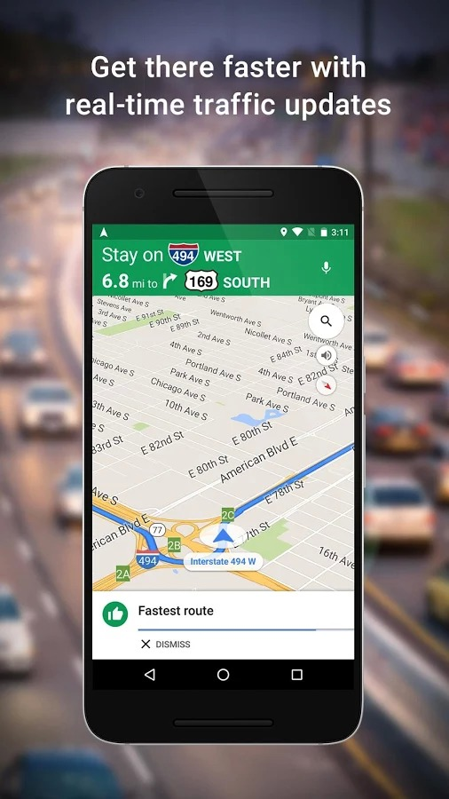
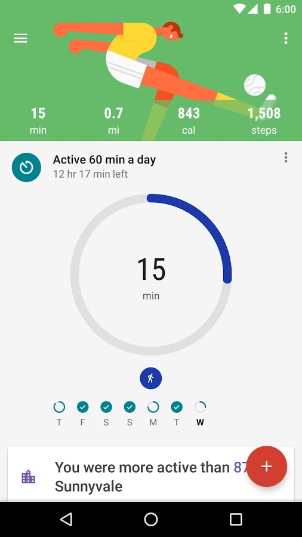

^ When Google releases a new website and mobile app, you know what to expect. You know it's going to be very stable, sync with your Google account, look and feel a certain way.

---

^ When Adam Sandler comes out with a new movie, you know exactly what you are getting. You know the role he is going to play, you know the type of comedy he is performing, you even know who is all going to be in it pretty much.

---

### When you release products, your audience...

* Have expectations for you.
* Engages with your business more.
* Builds trust.

^ (read it)

---

Cool.

## Now, how do I come up with ideas?

^ Cool. You know why to build. How do you do it?

---

Be your customer. **Get in their head.**

What problems do they have?

^ To think of ideas, you need to get in your customer's head. If you do not know your customer all that well, you may not find as much success here yet.

^ Every problem they have from wake up to going to bed.

---

**Think to yourself,**

1. Do I have knowledge to share?
2. Can I re-use what already built?
3. Can I build an audience?
4. Do you have problems internally?

^ These are 4 methods that I use to think of ideas. (read it)

---

**Do I have knowledge to share?**

* eBooks
* Video courses
* Webinars

Jason Fried - Rework, Way To Work events.
Justin Jackson - Learns something, makes course.

^ I can guarantee that all of you have knowledge that someone else would find valuable. Guarantee it. Share it.

^ (read it)

---

**Can I re-use what already built?**

* Sell small pieces of main product
* License product

NomadList - Escape the Trump, Escape the Brexit.
Your Circle - Adoption, high schoolers.

^ In your main core product, you are solving tons of mini problems.

^ Can you license out your technology stack?

^ Do others find what you have built useful?

---

**Can I build an audience?**

* Forum online community
* Newsletter
* Podcast

Justin Jackson - Community, podcast, 100 Maker challenge.
Jason Fried - Community want to work like Basecamp.

^ Is there a way to build an audience with what you are doing?

^ 100 maker challenge...

---

**Do you have problems internally?**

* Team issues
* Blog about team
* Scratch your own itches

Crew - Unsplash
37 signals - Basecamp, Highrise, etc.

^ Crew builds websites. Needed to find better quality stock photography...

^ 37 signals, a design consulting company had problems managing team. Built basecamp...

---

I have an idea. How do I build it?

* Tumblr, Squarespace (site).
* Mailchimp, Revue (newsletter).
* Gumroad (store).
* Teachable, Coach (teach course).
* Medium, Ghost (blog).

^ We are so lucky today...

^ I challenge you to build without code and design...

^ There are many more ways...

---

1. Build side project (start with just a landing page).

2. Maintain if you see it working.

3. Repeat.

Experiment. Have fun. Don't sweat it.

^ Your side projects are going to fail and they will succeed. Build then, maintain if doing well, repeat.

^ Don't sweat it. Learn something and it will grow an audience along the way if it fails anyway.

---

### **Q:** Do blogs and ads suck? Should I stop doing them?

^ No. In fact, blogs are products themselves...

---

“It’s more likely you’ll use a good product many times than read a good blog post many times. With a blog, you need to continually produce content at a high level and high rate to keep people coming back. This is possible, it just takes longer”
### -- Crew’s founder Mikael.

^ (read it)

---

### **Q:** Once I create all of these products, do I need to maintain them all?

^ No. Ask yourself this (next slide)

---

### “Will improving this existing project be more valuable than building a new one?”

1. Unsplash.com
2. App vs Website
3. Blog
4. Moodboard
5. Build an online business
6. ~~Launch this year~~

^ Crew only maintains it's top 5 referral source to Crew.co. In fact, I know of 2 I used to use and they are no longer on their website.

---

### **Q:** What if a side product takes up too much of my time? It gets tons of traction?

^ (read it)

---

### Sometimes, projects turn into it's own business.
# [fit] Unsplash

#### (started to solve team problem)

^ Unsplash started as a side product of Crew and this year it officially turned into Unsplash Inc.

---

# [fit] Basecamp.com

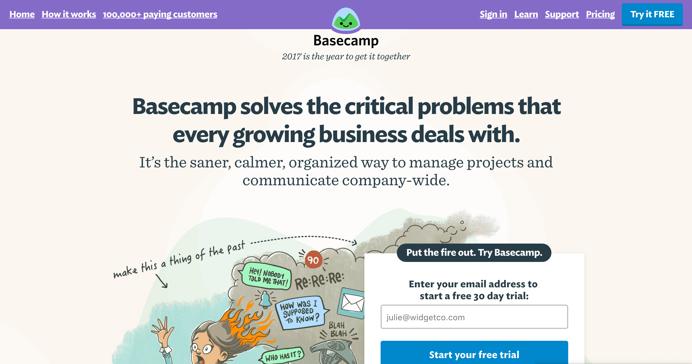

#### (started as internal project)

^ Basecamp started as a side project internally and turned into a business on it's own as well.

---

### **Q:** What do I charge for these side products I create?

^ Up to you. Most give away for free. However, build in a way they would pay.

---

### **Q:** Where am I in this journey?

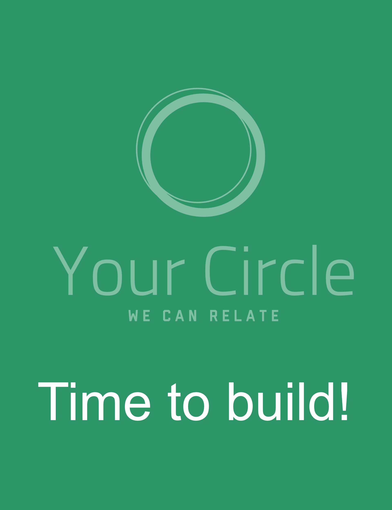
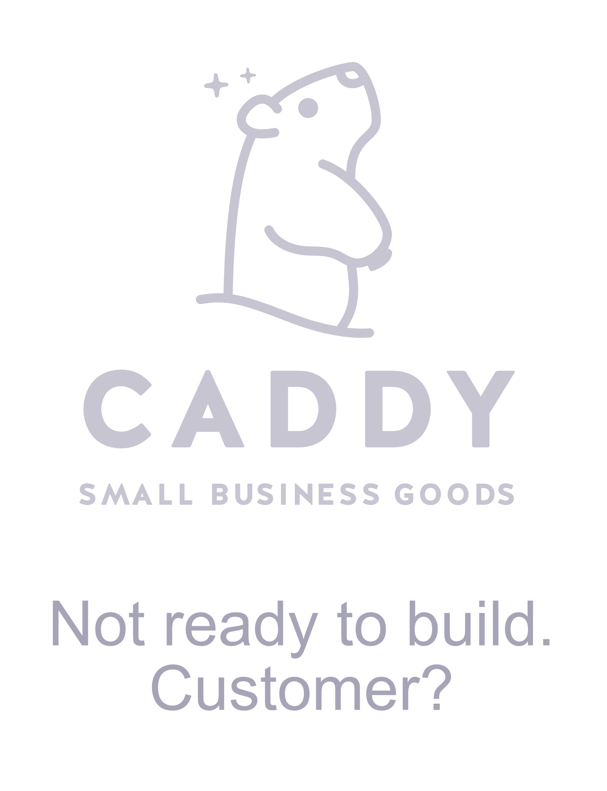

^ It's a journey alright. I am not as far along as any of the companies in this talk.

^ With Your Circle, I have just hit the time to build.

^ Caddy. I can't get into customers head yet.

---

### **Q:** Where do I go for more? Notes, resources, this talk?

# [fit] SideProject.life

^ (read it)

---

# Keep up with stuff I build, write, teach @ levibostian.com

## Ask me anything.

@levibostian

levi.bostian@gmail.com

SideProject.life
