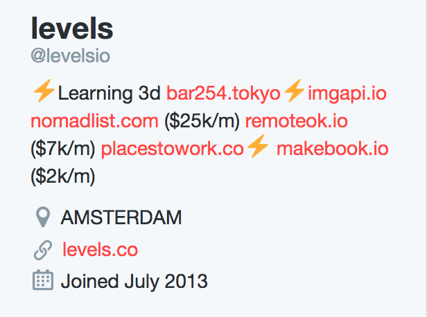

Do you remember your goals for 2016? Seems so long ago, doesn't it? My 2016 was all about products. How to build products. How to sell products. Learn why people bought products. The business models behind products. I obsessed over products.

This is where this journey began. January or February of last year I was browsing Twitter as I always do. I was reading the tweets from Levels.io. If you are not sure who Pieter Levels is, he created this website called NomadList.com. He is popular online in the product community as he is pretty chatty about how he bootstrapped NomadList and how he taught himself how to make websites to create NomadList. He is very much  this type of person.

Anyway, I was reading some tweets from him about who knows what and as I was browsing his profile, I read his bio: . He listed all of the different products that he was developing including but not limited to NomadList.

I had no idea he was involved with so many projects at that time. He started (NomadList) to help digital nomads find the best places to work, started a remote job search site, a couple small passion projects around VR, and was writing a book. I thought to myself that this was pure genius. Pure genius.

Levels created NomadList as his main push but he did not stop there. From all of his hard work creating NomadList, he created 3 or 4 other side projects from all that hard work. I was thinking, why on Earth don't other founders do this? You work so hard to building your main project but while you do that, why not use all of that hard work, build more with it, and reach a bigger audience?

(I actually did not start my journey out with levels back last year. I think it started with justin jackson with his makers newsletter where he made 100 things. i wanted to try products because of my freelancing and banno experience. justin helped me to find community on twitter of people to read about.)

To have a successful product, you need to have an audience. Everyone finds out about you, your business, and your product through different avenues. Why should you build one product as stop there? It is very challenging to reach out to your full audience at once. When opportunities come your way to build your audience, take it. Once you have an audience, spreading the word about your product is much easier. Do what you can to build that audience.

In fact, Ryan Hoover the CEO of ProductHunt started a short conversation on Twitter about this a couple weeks ago https://medium.com/@rrhoover/building-a-startup-build-an-audience-first-9fbba4f1fa15. He talked about how important it is for your business to have an audience. He suggests building an audience on day 1 and using that audience to grow your product reach. Ryan is very, very good at this. Very good at growing an audience.

This idea of growing an audience to reach your market for your product is not a new concept. In fact, that is what content marketing is all about. Creating new content that you can throw out to the world hoping to satisfy your existing audience and to grow it at the same time. That is content marketing.

"People hire products to make their lives better." I did not make this quote, haha. But it is extremely important. If you need to write anything down for your notes to sum up this talk, it is this. All of the apps on your phone. The clothes you decided to wear today. The books you read. The videos you watch on YouTube. The notebook you write on. You have hired these products you use every single day to improve your life. To solve problems in your life.

In order for someone to buy your core product, they need to:

* Have the problem in their life that your product solves.
* Have the problem bad enough the cost of your product is worth it.
* Trust you enough to give their hard earned money to give you a shot.

Releasing side projects for your brand helps for all of those reasons above. If an individual does not currently have the problem your core product solves but they might in the future, is there another problem they have in their life right now that you can hook them with? Then in the future when they do have the main problem your core product solves, they already know you. They are already part of your audience. They already trust you and they feel comfortable with products that you build.

When people are evaluating products to buy, they buy on trust. How many of you ask friends about a product before you buy it? How many of you look up reviews online? People become fully engaged to your product (hopefully) and use it regularly to continuously get reminded about your brand. This engagement is so important because of the trust that you gain in your brand. People get to see how fast your products are. How easy they are to use. How beautiful they are. How fun they are to use.

> Each and every product that you release is show and tell for your company. -- me

This is all great, Levi. I can see that building side products for my business is a real opportunity. Now, how do I get started?

Great question. It all starts with thinking about your customer. Who is the target user for your core product? Who is this individual? What is their age? Their profession? Are they a manager, a sales exec, a writer, who is this person and what do they do each and every day? If you cannot describe this person to me and prove this person is your target user, then you cannot move forward yet. You need to get into the head of your target user. The more that you know about your target user the higher the chances of success in your business period. I truly believe the person who knows their target user the best will win.

Now, think about **all** of the problems this target user faces each and every day. If you can put yourself in the head of your target user, you should not have a problem doing this. What are all of the problems that they face in their day to day life? Write all of them down. Every one. Now, think about your business. Out of all of those problems you listed, what problem can you help the most with? How can you help them?
